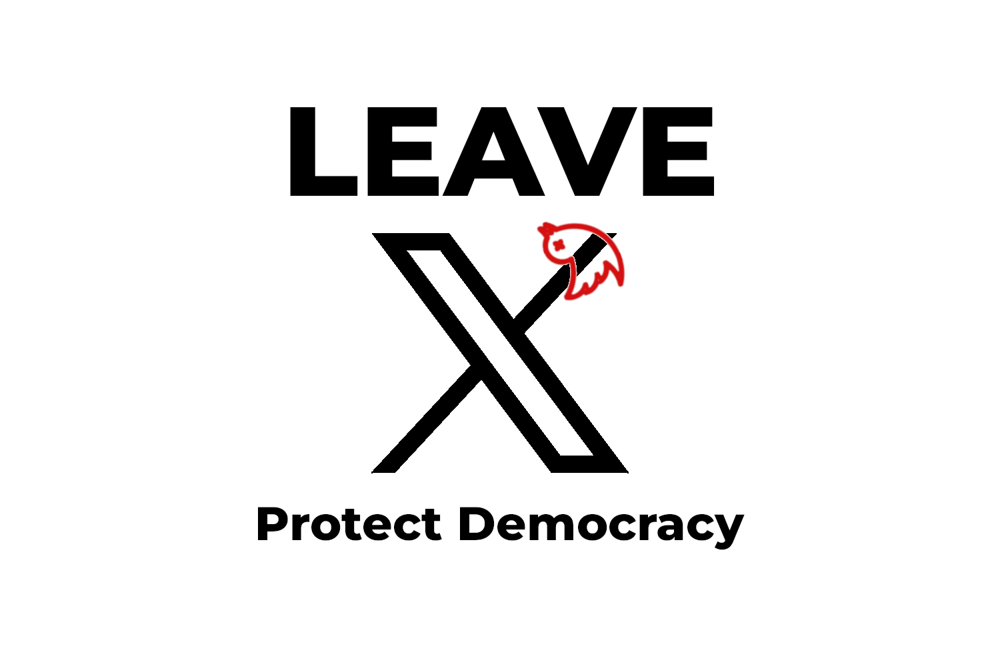

Diese Website dient als zentrale Plattform für die Veröffentlichung von **#LeaveX**, [Ein offener Brief an alle europäischen Politiker und Führungskräfte zur Abkehr von X/Twitter](../), sowie Übersetzungen in verschiedene offizielle europäische Sprachen. Wenn Sie diese Initiative unterstützen, laden wir Sie ein, [die Petition](https://openpetition.eu/leavex) zu unterzeichnen und zu teilen.

Der Brief formuliert die Kernbotschaft und die Gründe hinter dieser Initiative. Die Vision geht jedoch weit über die Online-Beteiligung hinaus. Über diese Plattform möchten wir:

* **Mit gleichgesinnten Gruppen, Bewegungen und Einzelpersonen vernetzen**, die sich dem Schutz der Demokratie und der Förderung transparenter, ethischer Kommunikation verpflichtet fühlen.
* **Politiker und Führungskräfte direkt kontaktieren**, um bedeutungsvolle Maßnahmen zu fordern.
* **Unterschriften persönlich sammeln**, um breite Unterstützung zu zeigen.
* **Das Bewusstsein schärfen** für die Gefahren von _Desinformationskampagnen_ und deren Auswirkungen auf demokratische Gesellschaften.

Wenn Sie Vorschläge, Korrekturen oder Ideen haben, schreiben Sie uns gerne eine E-Mail an [leavexeu@pm.me](mailto:leavexeu%40pm.me?subject=Ideen%20für%20Leave%20X). Sie können zu dieser Website auf [GitHub](https://github.com/everton137/leavex.eu) beitragen.

