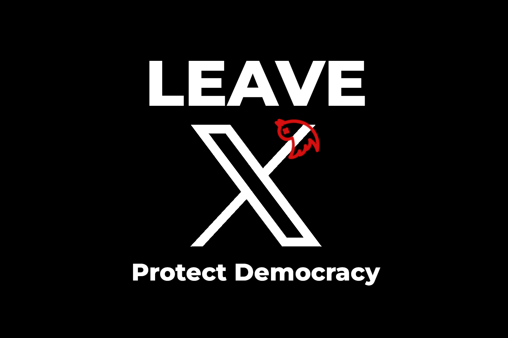

This website serves as the central platform for hosting [An Open Letter to All European Politicians and Leaders to Abandon X/Twitter](../), along with translations into various official European languages.

The letter articulates the core message and reasoning behind this initiative. However, the vision extends far beyond online engagement. Through this platform, we aim to:

* **Connect with like-minded groups, movements, and individuals** who share a commitment to protecting democracy and promoting transparent, ethical communication.
* **Contact politicians and leaders directly** to advocate for meaningful action.
* **Gather in-person signatures** to demonstrate widespread support.
* **Raise awareness** of the dangers of _disinformation campaigns_ and their impact on democratic societies.

