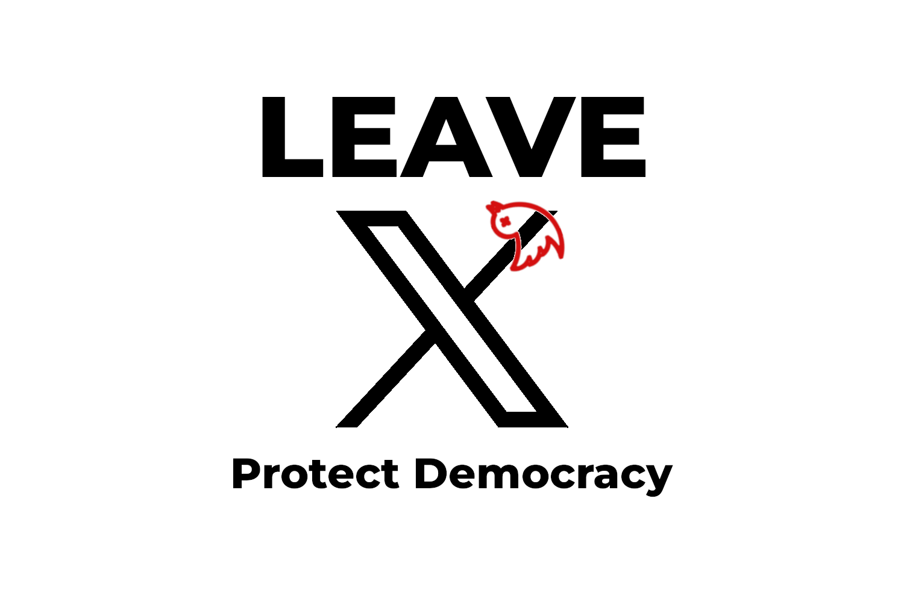

This website serves as the central platform for hosting **#LeaveX**, [An Open Letter to All European Politicians and Leaders to Abandon X/Twitter](../), along with translations into various official European languages. If you support this initiative, we invite you to sign and share [the petition](https://openpetition.eu/leavex).

The letter articulates the core message and reasoning behind this initiative. However, the vision extends far beyond online engagement. Through this platform, we aim to:

* **Connect with like-minded groups, movements, and individuals** who share a commitment to protecting democracy and promoting transparent, ethical communication.
* **Contact politicians and leaders directly** to advocate for meaningful action.
* **Gather in-person signatures** to demonstrate widespread support.
* **Raise awareness** of the dangers of _disinformation campaigns_ and their impact on democratic societies.

If you have suggestions, corrections, or ideas, feel free to email us at [leavexeu@pm.me](mailto:leavexeu%40pm.me?subject=Ideas%20for%20Leave%20X). You can contribute to this site on [GitHub  ](https://github.com/everton137/leavex.eu).

